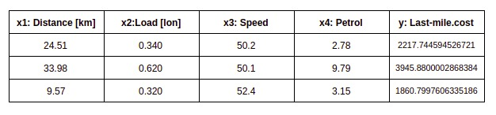
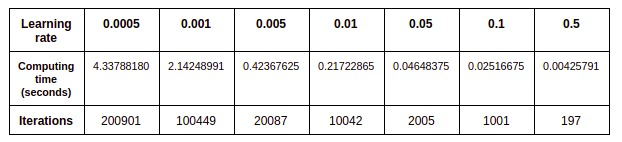

# Multilineal Regression
This repo is used for Multilineal Regression Practice

## Credits
Profesor: Dr. Andrés Hernández Gutiérrez

Student: Alan Rocha

## Prediction

### Discussion
Test data need to be feature scaled with the same parameters (mean, standard variance) from the training data, in order to use this data for the prediction. Also a column of 1 needs to be added as the training dataset. With this is possible to obtain the prediction just multiplying the two matrices to obtain the result.

## Times

### Discussion
The table shows that the larger the learning rate, the less iterations and the faster the code runs, but the `w` values ​​are less precise. This is because they perform "bigger jumps" with the largest learning rate.
